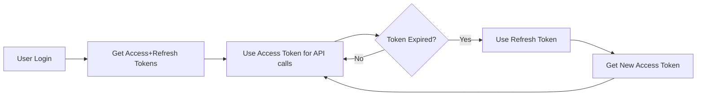

# TRADING JOURNAL API DOCUMENTATION

**Version:** 2.1.0  
**Last Updated:** January 7, 2026  
**Base URL:** `http://localhost:5000`  
**Environment:** Development/Production

---

## TABLE OF CONTENTS

1. [Introduction](#1-introduction)
2. [API Overview](#2-api-overview)
3. [Authentication & Authorization](#3-authentication--authorization)
4. [User Management](#4-user-management)
5. [Admin Operations](#5-admin-operations)
6. [Trade Management](#6-trade-management)
7. [Password Management](#7-password-management)
8. [System Status](#8-system-status)
9. [Error Handling](#9-error-handling)
10. [Rate Limiting](#10-rate-limiting)
11. [Frontend Integration Guide](#11-frontend-integration-guide)
12. [Testing Guidelines](#12-testing-guidelines)

---

## 1. INTRODUCTION

### 1.1 Purpose

This document provides comprehensive documentation for the Trading Journal API, designed to help frontend engineers integrate with the backend services. The API follows RESTful principles and uses JWT for authentication.

### 1.2 Target Audience

- Frontend Engineers
- Mobile Developers
- QA Engineers
- DevOps Team

### 1.3 Prerequisites

- Node.js 18+ or Bun runtime
- PostgreSQL database
- API testing tool (Postman, Insomnia, etc.)
- JWT understanding

### 1.4 Support

For API issues, contact:

- **Backend Team Lead:** **\***
- **API Support:** api-support@**\***.com
- **Emergency Contact:** dev-ops@**\*\*\***.com (for production issues)

---

## 2. API OVERVIEW

### 2.1 Base URLs

```
Development: http://localhost:5000
Staging:     https://api-staging.tradingjournal.com
Production:  https://api.tradingjournal.com
```

### 2.2 Versioning

- Current version: `v2`
- Version included in all endpoints: `/api/v2/*`
- Previous versions deprecated after 90 days

### 2.3 Response Format

All responses follow this structure:

```json
{
  "success": boolean,
  "data": object | array | null,
  "message": string,  // optional
  "error": {          // only on error
    "code": string,
    "message": string,
    "details": object // optional
  }
}
```

### 2.4 HTTP Status Codes

| Code | Description           | Usage                       |
| ---- | --------------------- | --------------------------- |
| 200  | OK                    | Successful GET, PUT, DELETE |
| 201  | Created               | Successful POST             |
| 400  | Bad Request           | Validation errors           |
| 401  | Unauthorized          | Invalid/missing token       |
| 403  | Forbidden             | Insufficient permissions    |
| 404  | Not Found             | Resource not found          |
| 409  | Conflict              | Resource already exists     |
| 429  | Too Many Requests     | Rate limit exceeded         |
| 500  | Internal Server Error | Server error                |

### 2.5 Headers

| Header          | Required | Description                  |
| --------------- | -------- | ---------------------------- |
| `Authorization` | Yes\*    | `Bearer <accessToken>`       |
| `Content-Type`  | Yes\*    | `application/json`           |
| `Accept`        | No       | `application/json` (default) |

\*Required for authenticated endpoints

---

## 3. AUTHENTICATION & AUTHORIZATION

### 3.1 Overview

- JWT-based authentication
- Two-token system (access + refresh)
- Role-based access control (RBAC)

### 3.2 User Roles

| Role          | Permissions                            | Description          |
| ------------- | -------------------------------------- | -------------------- |
| `USER`        | Basic trading operations               | Regular user         |
| `ADMIN`       | User management + all USER permissions | System administrator |
| `SUPER_ADMIN` | All permissions                        | Full system access   |

### 3.3 Token Specifications

| Token Type    | Duration   | Purpose                  | Storage                 |
| ------------- | ---------- | ------------------------ | ----------------------- |
| Access Token  | 30 minutes | API authorization        | Memory/State            |
| Refresh Token | 7 days     | Obtain new access tokens | Secure HTTP-only cookie |

### 3.4 Authentication Flow



---

## 4. USER MANAGEMENT

### 4.1 Register User

**POST** `/api/v2/auth/register`

#### Request

```json
{
  "email": "user@example.com",
  "password": "StrongPass123",
  "firstName": "John",
  "lastName": "Doe"
}
```

#### Validation Rules

| Field     | Type   | Required | Constraints                                     |
| --------- | ------ | -------- | ----------------------------------------------- |
| email     | string | Yes      | Valid email, unique                             |
| password  | string | Yes      | Min 8 chars, 1 uppercase, 1 lowercase, 1 number |
| firstName | string | No       | Max 50 chars                                    |
| lastName  | string | No       | Max 50 chars                                    |

#### Response (201 Created)

```json
{
  "success": true,
  "message": "Registration submitted. Your account will be activated after admin approval.",
  "data": {
    "user": {
      "id": "095db4d1-af6f-4ee2-a55b-c835d1461304",
      "email": "user@example.com",
      "firstName": "John",
      "lastName": "Doe",
      "role": "USER",
      "isEmailVerified": false,
      "isActive": false,
      "lastLoginAt": null,
      "createdAt": "2026-01-07T05:29:18.411Z",
      "updatedAt": "2026-01-07T05:29:18.411Z"
    }
  }
}
```

### 4.2 Login

**POST** `/api/v2/auth/login`

#### Request

```json
{
  "email": "user@example.com",
  "password": "StrongPass123"
}
```

#### Response (200 OK)

```json
{
  "success": true,
  "data": {
    "user": {
      "id": "cdd47d43-0f0e-4681-8f57-4fc80294aa9d",
      "email": "user@example.com",
      "firstName": "John",
      "lastName": "Doe",
      "isEmailVerified": true,
      "isActive": true,
      "role": "USER",
      "lastLoginAt": "2026-01-07T07:08:17.139Z",
      "createdAt": "2026-01-07T05:26:47.341Z",
      "updatedAt": "2026-01-07T07:08:17.141Z"
    },
    "accessToken": "eyJhbGciOiJIUzI1NiIsInR5cCI6IkpXVCJ9...",
    "refreshToken": "eyJhbGciOiJIUzI1NiIsInR5cCI6IkpXVCJ9..."
  }
}
```

### 4.3 Get Current User

**GET** `/api/v2/auth/me`

#### Headers

```
Authorization: Bearer <accessToken>
```

#### Response (200 OK)

```json
{
  "success": true,
  "data": {
    "user": {
      "id": "cdd47d43-0f0e-4681-8f57-4fc80294aa9d",
      "email": "user@example.com",
      "firstName": "John",
      "lastName": "Doe",
      "isEmailVerified": true,
      "isActive": true,
      "role": "USER",
      "lastLoginAt": "2026-01-07T07:08:17.139Z",
      "createdAt": "2026-01-07T05:26:47.341Z",
      "updatedAt": "2026-01-07T07:08:17.141Z"
    }
  }
}
```

### 4.4 Refresh Token

**POST** `/api/v2/auth/refresh`

#### Request

```json
{
  "refreshToken": "eyJhbGciOiJIUzI1NiIsInR5cCI6IkpXVCJ9..."
}
```

#### Response (200 OK)

```json
{
  "success": true,
  "data": {
    "accessToken": "eyJhbGciOiJIUzI1NiIsInR5cCI6IkpXVCJ9...",
    "refreshToken": "eyJhbGciOiJIUzI1NiIsInR5cCI6IkpXVCJ9..."
  }
}
```

### 4.5 Logout

**POST** `/api/v2/auth/logout`

#### Request

```json
{
  "refreshToken": "eyJhbGciOiJIUzI1NiIsInR5cCI6IkpXVCJ9..."
}
```

#### Response (200 OK)

```json
{
  "success": true,
  "data": {
    "message": "Logged out successfully"
  }
}
```

### 4.6 Email Verification

**GET** `/api/auth/verify-email`

#### Query Parameters

| Parameter | Required | Description                   |
| --------- | -------- | ----------------------------- |
| token     | Yes      | Verification token from email |

#### Example Request

```
GET /api/auth/verify-email?token=f10c89f6826c88ae55f14df5e4fb6a30086d1a6cf0f1d6501c341caf5ec271e1
```

#### Response (200 OK)

```json
{
  "success": true,
  "data": {
    "message": "Email verified successfully"
  }
}
```

### 4.7 Resend Verification Email

**POST** `/api/v2/auth/resend-verification`

#### Request

```json
{
  "email": "user@example.com"
}
```

#### Response (200 OK)

```json
{
  "success": true,
  "data": {
    "message": "Verification email sent"
  }
}
```

---

## 5. ADMIN OPERATIONS

**Note:** All admin endpoints require `ADMIN` or `SUPER_ADMIN` role.

### 5.1 Get Pending Users

**GET** `/api/v2/admin/pending-users`

#### Response (200 OK)

```json
{
  "success": true,
  "data": {
    "users": [
      {
        "id": "user-id",
        "email": "pendinguser@example.com",
        "firstName": "Jane",
        "lastName": "Doe",
        "role": "USER",
        "isEmailVerified": false,
        "isActive": false,
        "createdAt": "2026-01-07T05:29:18.411Z"
      }
    ],
    "count": 1
  }
}
```

### 5.2 Approve User

**POST** `/api/v2/admin/approve/{userId}`

#### Path Parameters

| Parameter | Required | Description             |
| --------- | -------- | ----------------------- |
| userId    | Yes      | UUID of user to approve |

#### Response (200 OK)

```json
{
  "success": true,
  "message": "User approved successfully",
  "data": {
    "user": {
      "id": "user-id",
      "email": "user@example.com",
      "isActive": true,
      "updatedAt": "2026-01-07T07:25:26.786Z"
    }
  }
}
```

### 5.3 Deactivate User

**POST** `/api/v2/admin/deactivate/{userId}`

**Note:** Cannot deactivate `SUPER_ADMIN` accounts.

#### Response (200 OK)

```json
{
  "success": true,
  "message": "User deactivated successfully",
  "data": {
    "user": {
      "id": "cdd47d43-0f0e-4681-8f57-4fc80294aa9d",
      "email": "user@example.com",
      "isActive": false,
      "updatedAt": "2026-01-07T07:23:40.310Z"
    }
  }
}
```

### 5.4 Activate User

**POST** `/api/v2/admin/activate/{userId}`

#### Response (200 OK)

```json
{
  "success": true,
  "message": "User activated successfully",
  "data": {
    "user": {
      "id": "cdd47d43-0f0e-4681-8f57-4fc80294aa9d",
      "email": "user@example.com",
      "isActive": true,
      "updatedAt": "2026-01-07T07:25:26.786Z"
    }
  }
}
```

---

## 6. TRADE MANAGEMENT

### 6.1 Create Trade

**POST** `/api/v2/trades`

#### Request Body

```json
{
  "symbol": "BTCUSDT",
  "side": "LONG",
  "entryPrice": 50000,
  "exitPrice": 52000,
  "quantity": 0.1,
  "leverage": 10,
  "fees": 5.5,
  "stopLoss": 48000,
  "takeProfit": 55000,
  "entryTimestamp": "2024-01-15T10:00:00.000Z",
  "exitTimestamp": "2024-01-15T15:00:00.000Z",
  "strategyId": "strategy-uuid",
  "notes": "Good trade setup, followed the plan",
  "tags": ["breakout", "high-volume"],
  "screenshotUrl": "https://example.com/screenshot.png",
  "tradeScore": 85
}
```

#### Field Specifications

| Field          | Type     | Required | Validation                         | Default |
| -------------- | -------- | -------- | ---------------------------------- | ------- |
| symbol         | string   | Yes      | 1-10 chars, uppercase alphanumeric | -       |
| side           | enum     | Yes      | "LONG" or "SHORT"                  | -       |
| entryPrice     | decimal  | Yes      | > 0, < 1B                          | -       |
| exitPrice      | decimal  | No       | > 0, < 1B                          | null    |
| quantity       | decimal  | Yes      | 0.00000001 - 1,000,000             | -       |
| leverage       | integer  | No       | 1-125                              | 1       |
| fees           | decimal  | No       | ≥ 0                                | 0       |
| stopLoss       | decimal  | No       | > 0                                | null    |
| takeProfit     | decimal  | No       | > 0                                | null    |
| entryTimestamp | datetime | Yes      | ISO 8601, not future               | -       |
| exitTimestamp  | datetime | No       | ISO 8601, after entry              | null    |
| strategyId     | UUID     | No       | Valid UUID                         | null    |
| notes          | string   | No       | Max 2000 chars                     | null    |
| tags           | string[] | No       | Max 10 tags, 50 chars each         | []      |
| screenshotUrl  | string   | No       | Valid URL                          | null    |
| tradeScore     | integer  | No       | 1-100                              | null    |

#### Response (201 Created)

```json
{
  "success": true,
  "data": {
    "id": "clxxx123456",
    "userId": "user-uuid",
    "symbol": "BTCUSDT",
    "side": "LONG",
    "entryPrice": "50000",
    "exitPrice": "52000",
    "status": "CLOSED",
    "quantity": "0.1",
    "leverage": 10,
    "fees": "5.50",
    "pnlNet": "1994.50",
    "pnlPercentage": "39.89",
    "stopLoss": "48000",
    "takeProfit": "55000",
    "entryTimestamp": "2024-01-15T10:00:00.000Z",
    "exitTimestamp": "2024-01-15T15:00:00.000Z",
    "strategyId": "strategy-uuid",
    "notes": "Good trade setup, followed the plan",
    "tags": ["breakout", "high-volume"],
    "screenshotUrl": "https://example.com/screenshot.png",
    "tradeScore": 85,
    "createdAt": "2024-01-15T16:00:00.000Z",
    "updatedAt": "2024-01-15T16:00:00.000Z"
  }
}
```

#### Trade Status

| Status | Condition         | Description           |
| ------ | ----------------- | --------------------- |
| OPEN   | exitPrice is null | Trade is still active |
| CLOSED | exitPrice is set  | Trade has been closed |

#### PnL Calculation

- **LONG**: `(exitPrice - entryPrice) × quantity × leverage - fees`
- **SHORT**: `(entryPrice - exitPrice) × quantity × leverage - fees`
- **Percentage**: `(pnlNet / (entryPrice × quantity)) × 100`

### 6.2 Get All Trades

**GET** `/api/v2/trades`

#### Query Parameters (Optional)

| Parameter | Type    | Description                    | Default        |
| --------- | ------- | ------------------------------ | -------------- |
| status    | string  | Filter by status (OPEN/CLOSED) | All            |
| symbol    | string  | Filter by symbol               | All            |
| side      | string  | Filter by side (LONG/SHORT)    | All            |
| startDate | date    | Filter trades after this date  | None           |
| endDate   | date    | Filter trades before this date | None           |
| page      | integer | Page number for pagination     | 1              |
| limit     | integer | Items per page                 | 20             |
| sortBy    | string  | Field to sort by               | entryTimestamp |
| order     | string  | Sort order (asc/desc)          | desc           |

#### Response (200 OK)

```json
{
  "success": true,
  "data": {
    "trades": [
      {
        "id": "clxxx123456",
        "symbol": "BTCUSDT",
        "side": "LONG",
        "status": "CLOSED",
        "entryPrice": "50000",
        "exitPrice": "52000",
        "quantity": "0.1",
        "pnlNet": "1994.50",
        "pnlPercentage": "39.89",
        "entryTimestamp": "2024-01-15T10:00:00.000Z",
        "exitTimestamp": "2024-01-15T15:00:00.000Z",
        "createdAt": "2024-01-15T16:00:00.000Z"
      }
    ],
    "pagination": {
      "total": 25,
      "page": 1,
      "limit": 20,
      "totalPages": 2
    }
  }
}
```

### 6.3 Get Single Trade

**GET** `/api/v2/trades/{tradeId}`

#### Response (200 OK)

```json
{
  "success": true,
  "data": {
    "id": "clxxx123456",
    "userId": "user-uuid",
    "symbol": "BTCUSDT",
    "side": "LONG",
    "entryPrice": "50000",
    "exitPrice": "52000",
    "status": "CLOSED",
    "quantity": "0.1",
    "leverage": 10,
    "fees": "5.50",
    "pnlNet": "1994.50",
    "pnlPercentage": "39.89",
    "stopLoss": "48000",
    "takeProfit": "55000",
    "entryTimestamp": "2024-01-15T10:00:00.000Z",
    "exitTimestamp": "2024-01-15T15:00:00.000Z",
    "strategyId": null,
    "notes": "Good trade setup",
    "tags": ["breakout"],
    "screenshotUrl": null,
    "tradeScore": 85,
    "createdAt": "2024-01-15T16:00:00.000Z",
    "updatedAt": "2024-01-15T16:00:00.000Z"
  }
}
```

### 6.4 Update Trade

**PUT** `/api/v2/trades/{tradeId}`

#### Request Body (Partial Update)

```json
{
  "exitPrice": 53000,
  "exitTimestamp": "2024-01-15T16:00:00.000Z",
  "notes": "Updated: Trade went better than expected",
  "tradeScore": 90
}
```

#### Response (200 OK)

```json
{
  "success": true,
  "data": {
    "id": "clxxx123456",
    "symbol": "BTCUSDT",
    "side": "LONG",
    "entryPrice": "50000",
    "exitPrice": "53000",
    "status": "CLOSED",
    "quantity": "0.1",
    "leverage": 10,
    "fees": "5.50",
    "pnlNet": "2994.50",
    "pnlPercentage": "59.89",
    "entryTimestamp": "2024-01-15T10:00:00.000Z",
    "exitTimestamp": "2024-01-15T16:00:00.000Z",
    "notes": "Updated: Trade went better than expected",
    "tradeScore": 90,
    "updatedAt": "2024-01-15T17:00:00.000Z"
  }
}
```

### 6.5 Delete Trade

**DELETE** `/api/v2/trades/{tradeId}`

#### Response (200 OK)

```json
{
  "success": true,
  "message": "Trade deleted successfully"
}
```

### 6.6 Get Trade Statistics

**GET** `/api/v2/trades/stats`

#### Query Parameters

| Parameter | Type   | Description          | Default |
| --------- | ------ | -------------------- | ------- |
| startDate | date   | Start date for stats | None    |
| endDate   | date   | End date for stats   | None    |
| symbol    | string | Filter by symbol     | All     |

#### Response (200 OK)

```json
{
  "success": true,
  "data": {
    "totalTrades": 25,
    "winningTrades": 15,
    "losingTrades": 10,
    "winRate": 60.0,
    "totalPnL": 5420.75,
    "avgPnL": 216.83,
    "bestTrade": {
      "id": "clxxx123456",
      "symbol": "BTCUSDT",
      "pnlNet": 1500.5
    },
    "worstTrade": {
      "id": "clxxx123457",
      "symbol": "ETHUSDT",
      "pnlNet": -450.25
    }
  }
}
```

**Note:** Statistics only include CLOSED trades.

---

## 7. PASSWORD MANAGEMENT

### 7.1 Request Password Reset

**POST** `/api/v2/password/request-reset`

#### Request

```json
{
  "email": "user@example.com"
}
```

#### Response (200 OK)

```json
{
  "success": true,
  "data": {
    "message": "If an account exists with this email, you will receive a password reset link."
  }
}
```

### 7.2 Reset Password

**POST** `/api/v2/password/reset`

#### Request

```json
{
  "token": "c5ab884a6451ab391207d8040bb5f7b78bdf43538b7506d4e3e1732918d86987",
  "newPassword": "NewStrongPass123"
}
```

#### Response (200 OK)

```json
{
  "success": true,
  "data": {
    "message": "Password reset successful. Please login with your new password."
  }
}
```

---

## 8. SYSTEM STATUS

### 8.1 Health Check

**GET** `/health`

#### Response (200 OK)

```json
{
  "status": "OK",
  "timestamp": "2026-01-07T07:30:00.000Z",
  "uptime": 86400.25,
  "environment": "development"
}
```

### 8.2 API Live Status

**GET** `/api/live`

#### Response (200 OK)

```json
{
  "status": "Live",
  "timestamp": "2026-01-07T07:30:00.000Z",
  "uptime": 86400.25,
  "environment": "development"
}
```

### 8.3 404 Handler

Any undefined route returns:

```json
{
  "success": false,
  "message": "Route not found",
  "path": "/api/nonexistent"
}
```

---

## 9. ERROR HANDLING

### 9.1 Error Response Format

```json
{
  "success": false,
  "error": {
    "code": "ERROR_CODE",
    "message": "Human readable error message",
    "details": {
      // Optional additional information
    }
  }
}
```

### 9.2 Common Error Codes

| Code                    | HTTP Status | Description                               |
| ----------------------- | ----------- | ----------------------------------------- |
| `VALIDATION_ERROR`      | 400         | Request validation failed                 |
| `UNAUTHORIZED`          | 401         | Invalid/missing authentication            |
| `FORBIDDEN`             | 403         | Insufficient permissions                  |
| `NOT_FOUND`             | 404         | Resource not found                        |
| `CONFLICT`              | 409         | Resource conflict (e.g., duplicate email) |
| `TOO_MANY_REQUESTS`     | 429         | Rate limit exceeded                       |
| `INTERNAL_SERVER_ERROR` | 500         | Server error                              |

### 9.3 Validation Error Example

```json
{
  "success": false,
  "error": {
    "code": "VALIDATION_ERROR",
    "message": "validation failed",
    "details": {
      "errors": [
        {
          "field": "body.email",
          "message": "Invalid email format"
        },
        {
          "field": "body.password",
          "message": "Password must be at least 8 characters"
        }
      ]
    }
  }
}
```

---

## 10. RATE LIMITING

### 10.1 Limits

| Endpoint Type   | Limit        | Window     |
| --------------- | ------------ | ---------- |
| Authentication  | 5 requests   | 15 minutes |
| API endpoints   | 100 requests | 15 minutes |
| Admin endpoints | 50 requests  | 15 minutes |

### 10.2 Rate Limit Headers

```
X-RateLimit-Limit: 100
X-RateLimit-Remaining: 95
X-RateLimit-Reset: 1625097600
Retry-After: 900
```

---

## 11. TESTING GUIDELINES

### 11.1 API Testing Checklist

- [ ] Authentication endpoints working
- [ ] Trade CRUD operations functional
- [ ] Admin operations restricted to admins
- [ ] Validation errors properly formatted
- [ ] Error handling consistent
- [ ] Rate limiting in effect
- [ ] CORS headers properly set

### 11.2 Postman Collection

Import the following collection for testing:

```json
{
  "info": {
    "name": "Trading Journal API",
    "schema": "https://schema.getpostman.com/json/collection/v2.1.0/collection.json"
  },
  "item": [
    {
      "name": "Authentication",
      "item": [
        {
          "name": "Register User",
          "request": {
            "method": "POST",
            "url": "{{baseUrl}}/api/v2/auth/register",
            "body": {
              "mode": "raw",
              "raw": "{\n  \"email\": \"test@example.com\",\n  \"password\": \"TestPass123\",\n  \"firstName\": \"Test\",\n  \"lastName\": \"User\"\n}"
            }
          }
        }
      ]
    }
  ]
}
```

### 11.3 Common Test Scenarios

#### Scenario 1: User Registration Flow

1. Register new user
2. Verify email sent
3. Admin approves user
4. User logs in successfully
5. User accesses protected endpoints

#### Scenario 2: Trade Management

1. Create trade (OPEN status)
2. Update trade with exit price (changes to CLOSED)
3. Verify PnL calculation
4. Delete trade
5. Verify trade statistics update

#### Scenario 3: Error Cases

1. Invalid token (should return 401)
2. Invalid trade data (should return 400 with validation errors)
3. Access admin endpoint as USER (should return 403)
4. Rate limit exceeded (should return 429)

---

## APPENDIX

### A. Data Types

| Type     | Description                      | Example                                |
| -------- | -------------------------------- | -------------------------------------- |
| UUID     | Version 4 UUID                   | `095db4d1-af6f-4ee2-a55b-c835d1461304` |
| DateTime | ISO 8601 UTC                     | `2026-01-07T05:29:18.411Z`             |
| Decimal  | String representation of decimal | `"50000.00"`                           |
| Enum     | Predefined string values         | `"LONG"`, `"SHORT"`                    |

### B. Changelog

#### v2.1.0 (2026-01-07)

- Added health check endpoints
- Improved error messages
- Enhanced validation
- Added trade statistics endpoint

#### v2.0.0 (2025-12-15)

- Complete API redesign
- JWT authentication
- Role-based access control
- Enhanced trade management

### C. Support Contact

For API support:

### D. SLA (Service Level Agreement)

---

**Document ID:** API-DOC-TJ-2026-001  
**Revision:** 2.0  
**Approved By:** Junaid Ali Khan
**Valid Until:** June 7, 2026
